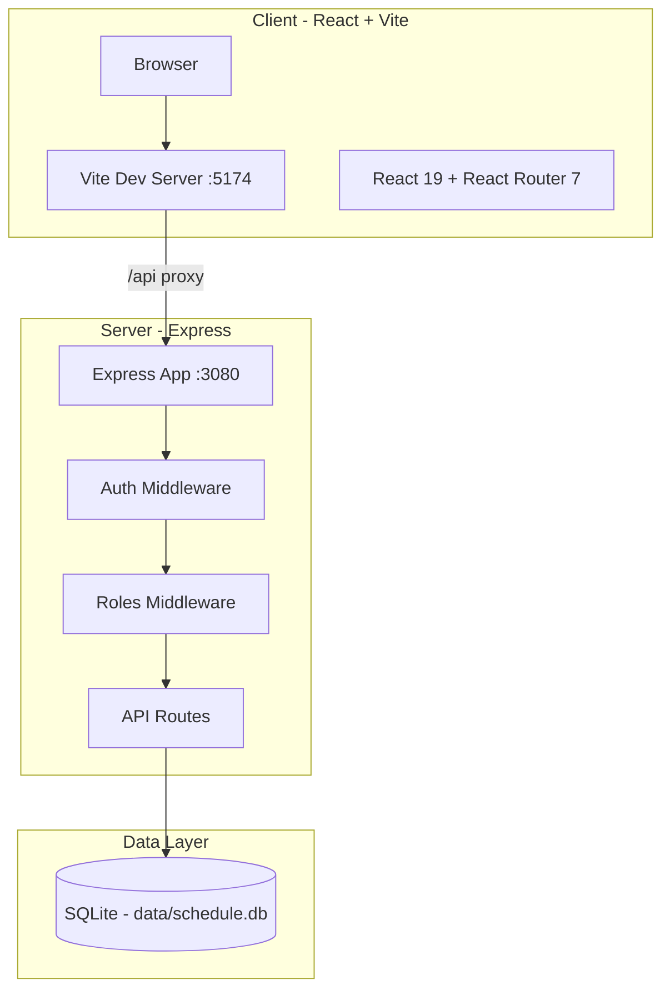
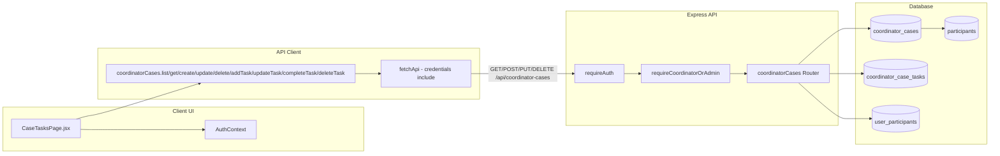
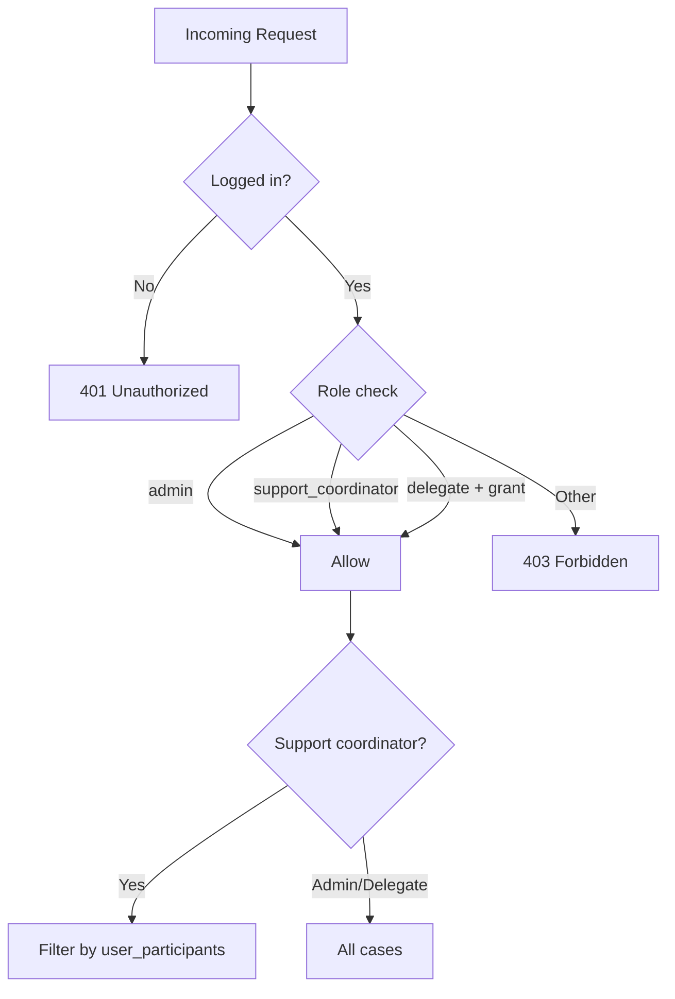

# Nexus Core Infrastructure Overview

## High-Level Architecture



---

## Project Structure

```
nexus core/
├── client/                 # React SPA (Vite)
│   ├── src/
│   │   ├── pages/          # Page components (CaseTasksPage, etc.)
│   │   ├── components/     # Reusable UI (SearchableSelect, etc.)
│   │   ├── context/        # AuthContext
│   │   └── lib/            # api.js (fetchApi, coordinatorCases, etc.)
│   └── vite.config.js      # Proxy /api → http://127.0.0.1:3080
├── server/
│   ├── src/
│   │   ├── index.js        # Express app, route registration, middleware
│   │   ├── routes/         # auth, participants, coordinatorCases, etc.
│   │   ├── middleware/     # auth.js, roles.js
│   │   └── db/             # SQLite init + migrations
│   └── package.json
├── database/
│   └── schema.sql          # Base schema (participants, users, etc.)
├── data/                   # Runtime data
│   ├── schedule.db         # SQLite database
│   └── uploads/            # File uploads
└── package.json            # "npm start" runs server + client concurrently
```

---

## Client Cases Feature - Data Flow



---

## Database Schema (Client Cases)

| Table | Purpose |
|-------|---------|
| `coordinator_cases` | Parent case per participant (participant_id, title, description, status, due_date) |
| `coordinator_case_tasks` | Sub-tasks within a case (case_id, title, status, due_date, completed_at, sort_order, notes) |

**Relationships:**
- `coordinator_cases.participant_id` → `participants.id` (ON DELETE CASCADE)
- `coordinator_case_tasks.case_id` → `coordinator_cases.id` (ON DELETE CASCADE)

**Indexes:** `participant_id`, `status` (cases); `case_id` (tasks)

**Migration location:** [server/src/db/index.js](server/src/db/index.js) lines 736–778 (runs on server startup)

---

## API Endpoints (Client Cases)

| Method | Path | Purpose |
|--------|------|---------|
| GET | `/api/coordinator-cases` | List cases (query: `participant_id`, `status`) |
| POST | `/api/coordinator-cases` | Create case |
| GET | `/api/coordinator-cases/:id` | Get case with tasks |
| PUT | `/api/coordinator-cases/:id` | Update case |
| DELETE | `/api/coordinator-cases/:id` | Delete case (cascades to tasks) |
| POST | `/api/coordinator-cases/:id/tasks` | Add task |
| PUT | `/api/coordinator-cases/:id/tasks/:taskId` | Update task |
| PUT | `/api/coordinator-cases/:id/tasks/:taskId/complete` | Mark task complete |
| DELETE | `/api/coordinator-cases/:id/tasks/:taskId` | Delete task |

**Middleware chain:** `requireAuth` → `requireCoordinatorOrAdmin` → route handler

---

## Access Control



**Key files:**
- [server/src/middleware/roles.js](server/src/middleware/roles.js): `requireCoordinatorOrAdmin`, `canAccessParticipant`, `getAssignedParticipantIds`
- [server/src/routes/coordinatorCases.js](server/src/routes/coordinatorCases.js): `filterByAccess()` filters list by assigned participants

---

## Runtime Configuration

| Component | Port/Path | Config |
|-----------|-----------|--------|
| Express server | 3080 (from `package.json` script) | `PORT`, `DATABASE_PATH`, `SESSION_SECRET` |
| Vite dev server | 5174 | `client/vite.config.js` |
| API proxy | `/api` → `http://127.0.0.1:3080` | `client/vite.config.js` |
| SQLite DB | `data/schedule.db` | `DATABASE_PATH` or default |

**Note:** `package.json` runs server with `PORT=3080`; Vite proxy targets 3080. Ensure both match.

---

## Key Files Summary

| Layer | File | Purpose |
|-------|------|---------|
| Frontend | `client/src/pages/CaseTasksPage.jsx` | Client Cases UI |
| Frontend | `client/src/lib/api.js` | `coordinatorCases` API client |
| Frontend | `client/src/context/AuthContext.jsx` | `canAccessCaseTasks` for nav visibility |
| Backend | `server/src/routes/coordinatorCases.js` | REST routes |
| Backend | `server/src/middleware/roles.js` | `requireCoordinatorOrAdmin` |
| Backend | `server/src/db/index.js` | Table migrations |
| Backend | `server/src/index.js` | Route registration |
| Routing | `client/src/App.jsx` | Nav link, `/case-tasks` route |
